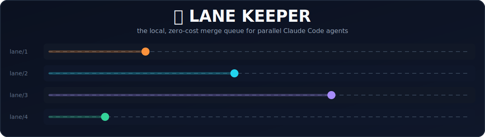

<p align="center">
  
</p>

<p align="center">
  
  
  
  
</p>

# Claude Code Local Merge 🚦

Claude Code already isolates your agents — `--worktree` (or `isolation:
"worktree"` on a subagent) gives every session its own git worktree, natively,
no setup. That part's solved. Claude Code Local Merge is the part that comes after: what
happens when four isolated agents all try to land, build, and test *at the
same time*.

- 🏁 Everyone pushes to the same branch, someone loses the race, and the
  rejected push turns into a rebase, which sometimes turns into *another*
  rejected push.
- 🔥 A full build is heavy. Four of them running at once turn your laptop
  into a space heater.
- 🎲 If your tests hit a shared database, concurrent runs race each other's
  resets. The failures look flaky. They are not flaky. They're just honest.

None of that is a skill issue. It's what happens when several fast,
confident processes share one mutable thing with no traffic control.

Telling the agents to "please coordinate" doesn't fix it. An agent (or a
teammate in a hurry) will violate a documented convention exactly once, at
exactly the wrong moment, and mean nothing by it.

**So don't ask nicely. Make the collision impossible.** 🚦

**The local, zero-cost merge queue for parallel Claude Code agents.**

## ⚡ Quickstart

```bash
npm install --save-dev claude-code-local-merge   # or: pnpm add -D / yarn add -D / bun add -d
npx claude-code-local-merge init
```

This does the whole setup, not just the config file:

- **`claude-code-local-merge.config.mjs`** — `integrationBranch` auto-detected from your
  current branch, `checkCommand` auto-detected from package.json
  (`check:push` / `check` / `ci` / `test`, first match wins).
- **`CLAUDE.md`** (or appends to yours if you already have one) — the part
  that makes the whole thing hands-off. Claude Code reads it automatically,
  every session, and it tells the agent to land its own work once green,
  without being asked. See "The hands-off part" below.
- **`.claude/settings.json`** — the `WorktreeCreate` hook wired in (created,
  or merged into your existing settings without touching anything else
  already there).
- **`.husky/pre-push`** — created or appended to, *if* you already have
  Husky. If you don't, `init` tells you so instead of silently writing to
  the untracked, not-shared-with-your-team `.git/hooks/pre-push`.
- **`package.json` scripts** — `land`, `sync`, `promote`, `preview`, and
  `preview:restore` added, skipping any you've already defined yourself.
- **`claude-code-local-merge-preflight.mjs`** + `preland`/`presync` scripts — a
  self-contained safety net npm runs automatically before `land`/`sync`. If
  this tool's own name/bin ever changes again (it has once — `lanekeeper` →
  `claude-code-local-merge`) and a lane hasn't rebased past that point yet, its
  `package.json` still calls the old name, which no longer exists — a bare,
  confusing `sh: lanekeeper: command not found`. This script catches that
  case with an actual diagnosis ("this branch is stale relative to
  origin/&lt;branch&gt; — rebase first") instead. It's deliberately plain
  JS with zero dependency on `claude-code-local-merge` itself, so it keeps working across
  future renames too.

**Commit everything it wrote**, then you're running. Two steps, not a setup
guide.

If `init` couldn't detect a `checkCommand` (no matching script in
package.json), every push is **blocked** until you set one — see 🧰 What's
in the box below. That's on purpose.

From here on: `claude --worktree <name>` to spin up an isolated lane —
Claude Code Local Merge's hook takes it from there, and CLAUDE.md tells the agent the rest.
You show up to run `claude-code-local-merge promote` when you actually want to ship. 🚀

## 🆚 vs. GitHub's Merge Queue

GitHub already ships a merge queue. Two things it costs you that this doesn't:

| | GitHub Merge Queue | Claude Code Local Merge |
|---|---|---|
| Private repo | **Enterprise Cloud only** | Any plan, any repo |
| Cost per landing | GitHub Actions minutes, every queue attempt | $0 — runs on your own machine |
| Requires | A pull request | Nothing — direct rebase + push |

Same idea — serialize landings, test before merge, keep history clean — run
locally instead of in someone else's billed cloud. 💸

## 🧰 What's in the box

| Command | What it does |
|---|---|
| `claude-code-local-merge hook worktree-create` | A Claude Code `WorktreeCreate` hook. Plugs Claude Code Local Merge's numbered lanes into Claude's *native* worktree creation — doesn't reinvent it. |
| `claude-code-local-merge build-lock -- <cmd>` | Runs `<cmd>` — your build — serialized across every lane, machine-wide. |
| `claude-code-local-merge land` | Rebases and pushes your lane onto the integration branch through a FIFO queue, so two lanes are never mid-push at once. Agents run this themselves — see below. |
| `claude-code-local-merge sync` | Fast-forwards your main checkout so a dev server actually sees what just landed — and re-installs dependencies if the lockfile changed, so the `node_modules` every lane symlinks from never goes stale. |
| `claude-code-local-merge promote` | Ships the integration branch to production. **Human-only** — never in an agent's instructions, never automated. |
| `claude-code-local-merge preview` | Instantly mirrors a lane's live working tree — uncommitted changes included — onto the main checkout, so you can look at it without a build. |
| `claude-code-local-merge port` | Prints a lane's dev-server port, derived from its own directory name. |
| `claude-code-local-merge prune` | Removes already-landed sibling lane worktrees on demand — `land` already does this automatically, this is for "clean these up right now" instead of waiting for the next lane to land something. |

Plus 🔒 a pre-push hook that makes `land` non-optional: a direct `git push`
straight to the integration branch gets bounced, full stop. Not a lint
warning. Not a Slack reminder. Rejected — with the actual command to run
instead. The same hook also runs your actual checks (`checkCommand` —
lint/typecheck/test/build) before allowing a landing through at all; a
config with no checkCommand set **fails every push by default** rather than
landing unverified code silently.

Every one of those blocks has a real, deliberate way out — see "The
emergency hatch" below — but it takes naming the specific branch you mean
to push, not one generic flag.

And 🧪 a documented extension point (`src/lib/ephemeral.ts` +
`examples/ephemeral-tmp-dir.example.ts`) for the thing every setup guide
skips: if your tests hit a shared resource — a database, a queue, anything
stateful — concurrent lanes need their own throwaway copy of it, and a
crashed run's copy needs to clean itself up without anyone noticing it died.

## ⚙️ Configuration

Everything lives in one file — see
[`examples/claude-code-local-merge.config.mjs`](examples/claude-code-local-merge.config.mjs) for every
field with comments. The short version:

```js
export default {
  branchPrefix: "lane/",               // lane/1, lane/2, ...
  worktreeSuffix: "-lane-",            // ../your-repo-lane-1
  portBase: 3000,                      // lane n gets portBase + n
  integrationBranch: "main",           // where agents land — see below
  productionBranch: null,              // set this for a two-stage model — see below
  protectedBranches: [],               // extra branches beyond the two above; most repos need none
  regenerableFiles: [],                // files a build tool rewrites — never block a rebase on these
  symlinks: [".env", ".env.local", "node_modules"],
  buildOutputDirs: ["dist", "build", ".next"], // preview never copies these onto your checkout
  checkCommand: "npm run check",       // what actually gates a landing — see below
  checksRequired: true,                // false = deliberately run with none; see below
};
```

Nothing here is hardcoded to any framework or branch model. 🧩 A malformed
config (empty branch names, a negative port, `productionBranch` equal to
`integrationBranch`, ...) fails loud with every problem listed, the moment
any command loads it — not a mysterious failure three steps later.

## 🚨 The emergency hatch

Every blocked push — the integration branch, `productionBranch`, anything
in `protectedBranches` — has a real way through it. One env var, no
prompts, no second factor to remember:

```bash
CLAUDE_CODE_LOCAL_MERGE_EMERGENCY_PUSH=1 git push origin HEAD:main
```

This is the one place that's honestly a convention, not a hard guarantee:
it stops mistakes and stray pushes, not an adversarial agent that sets the
var itself.

## 🙌 The hands-off part

Tests are the reviewer, not a human, at any point in this pipeline.

- **`checkCommand` gates landing.** Nothing reaches `integrationBranch`
  without passing it — the only correctness check most changes get.
- **`claude-code-local-merge promote` is a release decision, not a code
  review.** It means "this already-tested work should ship now," not "I
  read the diff." Your own CI on the production branch is a second
  automated checkpoint — still not a human one.
- **When something gets through anyway, the fix is a test, not a
  reviewer.** Every miss becomes a permanent guardrail, not a one-off catch.

Not for every team — if you want a human looking at every change before it
ships, this is missing that step on purpose.

## 🔁 The one idea underneath most of it

The build queue, the landing queue, and the ephemeral-resource pattern are
all crash-safe the **same way**:

1. Claim a resource.
2. Tag the claim with your process ID.
3. Let liveness — not a timeout — decide when a claim is stale.

`queue-lock.ts` does it for the build and landing queues; `ephemeral.ts`
does it for test resources. `kill -9` any of them mid-claim, and the next
process notices the PID is dead and reclaims it.

The `WorktreeCreate` hook is a cousin of the same idea for a one-shot
script with no process to check liveness against: the claim IS the
worktree, and `git worktree add` failing on an already-taken path is the
atomicity guard.

No stale locks, no "just restart your laptop," no magic timeout number. ✅

## 🔍 Know the limits

Things a sharp reader should already know before they ask:

- **One machine, not a fleet.** The FIFO queue lives in local temp storage —
  it doesn't coordinate across laptops. Two machines landing at once just
  get git's ordinary non-fast-forward rejection (safe, not corrupting — the
  loser re-fetches and retries, same as any team without a queue does today).
- **Not a security boundary.** Every guardrail here stops mistakes and
  convention drift, not a truly adversarial agent. Shell access always
  means `git push --no-verify`, deleting the hook, or editing the config on
  purpose — nothing local-only can stop that.
- **Guarantees a check ran — not that it's good.** It enforces that
  `checkCommand` exists and passed, with no way to know if that's a real
  test suite or `echo ok`. "Tests are the reviewer" is only as true as
  what's actually in them.
- **The `WorktreeCreate` hook is the youngest piece of this stack** — Claude
  Code shipped it Feb 2026. Losing it degrades gracefully: fall back to
  `git worktree add` by hand and you still keep the build queue, landing
  queue, preview, and ephemeral-resource pieces, none of which depend on it.
- **A slow `checkCommand` is a real throughput ceiling, not a free lunch.**
  The FIFO lock holds for its entire duration — one landing at a time,
  machine-wide. A 3–4 minute suite caps you well under 20 landings/hour
  flat-out, before any queue wait.
- **Rebase conflicts abort, they never guess.** `git rebase --abort` on any
  conflict, working tree left clean. Normally "you" here is the agent, not
  a human — CLAUDE.md tells it to resolve the conflict and re-run `land`,
  same as any other bug; `checkCommand` still catches a bad resolution.
- **Auto-pruning checks for a live Claude Code session, via `lsof`.** A
  merged branch alone isn't enough — a brand-new, zero-commit lane is
  *trivially* "merged" too, so pruning also refuses to touch a worktree
  with a live Claude Code process in it. Deliberately narrower than "any
  process at all": an orphaned MCP server or stray build process can
  outlive the session that spawned it and otherwise keep an abandoned lane
  stuck forever (confirmed live). Missing `lsof` fails closed — treats
  liveness as unknown, never removes.
- **The `WorktreeCreate` hook needs the host project's own real install.**
  It runs via `npx claude-code-local-merge hook worktree-create` (no
  `node_modules/.bin` on PATH for a raw hook, unlike an `npm run` script),
  and npx silently falls back to an ephemeral, unpinned copy if it can't
  resolve the package locally — which happened in production and masked a
  broken install for two lane-landings. The hook now refuses to run at all
  from npx's ephemeral cache, so a broken install fails loud immediately
  instead of limping along on a mismatched stand-in.

## 🧬 Where this came from

This is the extracted, generalized shape of tooling built to run several
parallel Claude Code agents on one real production codebase without them
tripping over each other. The names have been filed off; the mechanics
haven't.

## 📄 License

MIT. Fork it, rename it, argue with the config shape — that's the point.
